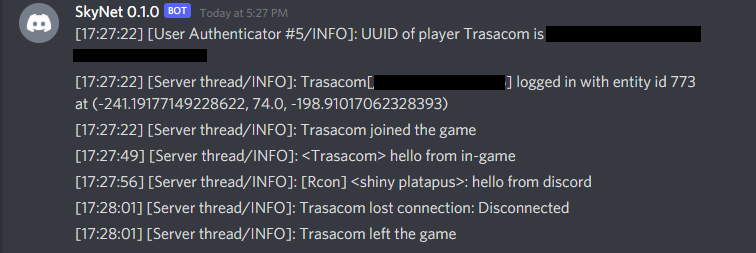

# DiscordMC

DiscordMC is a program that syncs a Minecraft server with Discord channels
without the usage of mods. It supports syncing to 2 different channels:
- An admin console channel one where the raw logs are dumped and any messages
  sent in the channel will be run as a command.
  
- A server chat channel one where the logs are formatted nicely and any
  messages sent in the channel will be broadcasted to the Minecraft server as a
  `say ...` command
  

By relying on the built-in [RCON](https://wiki.vg/RCON) protocol instead of
installing as a mod, this allows DiscordMC to be a drop-in solution in a
variety of scenarios.


# Getting started
## Installing

- Installing through the [Go](https://golang.org/) toolchain:
    ```
    go get github.com/chenbh/discordmc
    ```
- From GitHub releases:
    _TODO: offer prebuilt binaries_


## Usage

- _required_ `--token`: Discord [bot token](https://discord.com/developers/docs/topics/oauth2#bot-vs-user-accounts)
- _optional_ `--admin-channel`: Discord Channel ID to sync the server console with (bot must have view/send message permissions)
- _optional_ `--chat-channel`: Discord Channel ID to sync the server chat log with (bot must have view/send message permissions). Edit channel permissions can also be granted to have DiscordMC update the channel topic with the current server status periodically
- _optional_ `--status-interval`: Interval at which to refresh the server status in the chat channel. Must be empty string to disable it, or a valid [Go duration string](https://pkg.go.dev/time#ParseDuration). Defaults to `5m`
- _required_ `--host`: Host (IP or URL) of the Minecraft server. Defaults to `localhost`
- _required_ `--port`: Port of the RCON server. Defaults to `25575`
- _required_ `--pass`: Password for RCON server
- _required_ `--log`: Path to the Minecraft server's log file. Defaults to `logs/latest.log`

